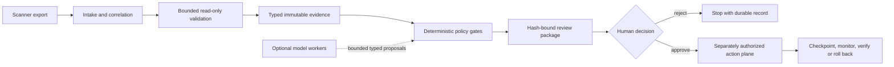
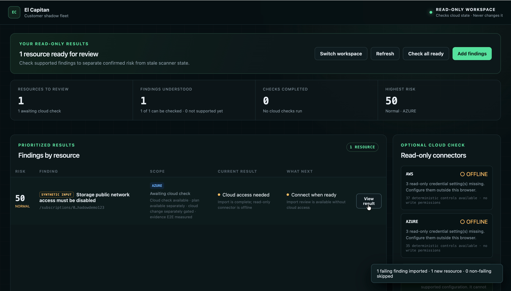

# El Capitan

El Capitan is an evidence-bound vulnerability remediation control plane. It
coordinates specialist agents and deterministic gates from finding intake
through live validation, risk prioritization, remediation planning, SRE review,
change-window selection, rollback review, human approval, deployment,
monitoring, verification, certificate issuance, and originator handoff.



The trust boundary is deliberate: scanner and observer identities are
read-only; optional models receive minimized evidence and cannot transition
workflow state; approval is bound to one exact package hash; and execution
requires a separately proven connector, identity, health contract, checkpoint,
and rollback path. Validation support never implies planning or execution
authority.

## Five-minute local quickstart

Start the read-only shadow console and PostgreSQL with no cloud or model
credentials:

```bash
docker compose up --build --detach --wait
```

Open `http://127.0.0.1:8770` and use the local-only token documented in the
[quickstart](docs/quickstart.md). The checked-in sample is synthetic; the UI
keeps source type, live outcome, capability authority, and evidence grade
separate. Run `docker compose down --volumes` when finished.

## Browser lifecycle demo

Run the complete staged product demonstration:

```bash
UV_CACHE_DIR=/private/tmp/elcapitan-uv-cache \
  uv run elcapitan serve-demo --prepare
```

Then open `http://127.0.0.1:8765`. The success scenario produces a remediation
certificate and handoff; the failure scenario proves automatic checkpoint
rollback and service recovery. See [the demo guide](docs/demo-guide.md) for the
five-minute script, safety boundaries, and Azure packaging notes.

Hermes is not required. Model-backed workers use a provider-neutral runtime
contract; deterministic workflow and policy code owns state and side effects.

The intended first public release is a self-hosted `v0.1.0` technical preview:
read-only shadow validation by default, explicit capability boundaries, and a
human-gated remediation package. See the [public release
blueprint](docs/public-release-v0.1.md) for its product promise, distribution,
security gates, and launch checklist. The
[generated capability/evidence matrix](docs/generated/capability-matrix.md)
keeps validation, planning, execution, and proof grade separate for every
registered control. Release material includes the
[engineering design article](docs/engineering-deterministic-gates.md),
[security design article](docs/security-design.md), and
[v0.1.0 release notes](docs/release-notes-v0.1.0.md).



## AWS/Azure customer shadow fleet

Run the authenticated, read-only fleet console separately from the action
plane:

```bash
export ELCAPITAN_SHADOW_ACCESS_TOKEN='use-a-random-value-with-at-least-24-characters'
UV_CACHE_DIR=/private/tmp/elcapitan-uv-cache \
  uv run elcapitan serve-shadow --workdir .elcapitan-shadow
```

Open `http://127.0.0.1:8770`. The console accepts OCSF, individual AWS
Security Hub ASFF findings, JSON arrays, and Security Hub response documents.
It builds a tenant-isolated, risk-ranked portfolio, reports exactly which
controls have deterministic support, and can validate up to 100 eligible cases
against live AWS or Azure configuration in one preflighted batch.

The shadow service deliberately has no approval, scheduling, model, or
execution endpoint. Scanner credentials are accepted only through the
`ELCAP_SCANNER_AWS_*` or `ELCAP_SCANNER_AZURE_*` environment contract;
ambient cloud profiles are ignored. See the
[customer shadow-run guide](docs/customer-shadow-run.md) before connecting a
real environment. Use the [first customer pilot profile](docs/first-customer-pilot.md)
to scope the CTO access request and select the initial account or subscription.

## Human decision plane

Run the review gate as a separate service over the same durable database:

```bash
export ELCAPITAN_REVIEW_ACCESS_TOKEN='use-a-different-random-value-with-at-least-24-characters'
export ELCAPITAN_DATABASE_URL='postgresql://...'
UV_CACHE_DIR=/private/tmp/elcapitan-uv-cache \
  uv run elcapitan serve-review --workdir .elcapitan-review
```

The review gate shows only the eight records referenced by the case's current
human-review package, verifies and displays the exact infrastructure source diff,
and requires a typed package-specific confirmation for approval or rejection.
Approval creates an immutable package-hash-bound `ChangeApproval.v1` and a
durable scheduled job. Rejection creates an immutable `ChangeRejection.v1` and
no job. The service has no execution or model endpoint and should run without a
cloud mutation identity.

Shared-token authentication is a non-production bridge. Replace it with the
trusted Entra ID approval adapter before accepting customer change approvals.

## Current product slice

The current implementation can:

- ingest OCSF findings and ASFF findings converted to OCSF;
- deduplicate replayed scanner events by source identity;
- correlate findings on the same tenant/cloud/account/resource;
- calculate a transparent, configurable priority;
- re-query supported Azure and AWS resources with a scoped read-only identity;
- deterministically confirm, clear, or block supported finding rules;
- link a validated resource to one unambiguous Terraform block or admitted AWS
  CDK construct and deployed CloudFormation logical resource;
- constrain a remediation proposal to the linked infrastructure source file;
- verify the isolated change with engine-specific format, synthesis,
  validation, and scope gates;
- run an independent SRE review against explicit service health context;
- derive bounded future change-window candidates from historical usage;
- independently verify rollback steps and observable rollback triggers;
- assemble a policy-checked human review package and stop for approval;
- bind authenticated approval to the exact review-package hash;
- durably schedule approved work with leases and missed-window protection;
- checkpoint, deploy, monitor, verify, automatically roll back, and recover;
- revalidate live configuration, deployed hashes, and allowlisted UI/API probes;
- issue a remediation certificate and originator handoff after release audit;
- rank validated cases as a fleet and flag service/window collisions;
- ingest and inspect a tenant-isolated AWS/Azure portfolio in an authenticated
  shadow console;
- preflight and batch live validation without exposing an action-plane route;
- route maker, checker, rollback, and release roles to different providers;
- persist immutable workflow events and projections in SQLite/WAL;
- prevent concurrent workers from opening two active cases for one asset;
- require typed records at every later workflow gate, including rollback.

Ingest one finding locally:

```bash
UV_CACHE_DIR=/tmp/elcapitan-uv-cache uv run elcapitan intake \
  tests/fixtures/prowler-ocsf-azure-sample.json \
  --tenant demo \
  --db /tmp/elcapitan-demo/product.db \
  --artifacts /tmp/elcapitan-demo/artifacts \
  --asset-criticality 0.8 \
  --reachable
```

The command prints the normalized finding id, correlated case id, priority,
workflow state, and whether the event was a duplicate.

Validate the resulting case with the provider's read-only scanner credential:

```bash
UV_CACHE_DIR=/tmp/elcapitan-uv-cache uv run elcapitan validate \
  --case CASE-... \
  --db /tmp/elcapitan-demo/product.db \
  --artifacts /tmp/elcapitan-demo/artifacts
```

For Azure, the validator consumes `ELCAP_SCANNER_AZURE_CLIENT_ID`,
`ELCAP_SCANNER_AZURE_CLIENT_SECRET`, and `ELCAP_SCANNER_AZURE_TENANT_ID`.
For AWS it consumes the corresponding `ELCAP_SCANNER_AWS_*` session
credential. Ambient cloud profiles are deliberately ignored.

Prepare a Terraform remediation after validation:

```bash
UV_CACHE_DIR=/tmp/elcapitan-uv-cache uv run elcapitan plan \
  --case CASE-... \
  --db /tmp/elcapitan-demo/product.db \
  --artifacts /tmp/elcapitan-demo/artifacts \
  --repo /path/to/customer/terraform \
  --agent-result /path/to/terraform-remediation-result.json \
  --state-json /path/to/terraform-state.json
```

`--state-json` accepts either raw Terraform state JSON or
`terraform show -json` output. It is optional for literal resource names and
required when state is needed to resolve computed names or `for_each`
instances. El Capitan stores only the matched address and a hash of the state,
not the full potentially sensitive state document.

The recorded agent result uses the provider-neutral
`TerraformRemediationProposal.v1` contract. Its `output` contains `objective`,
`files`, `prerequisites`, `steps`, `rollout_steps`, `verification_steps`,
`rollback_steps`, `rollback_triggers`, and `blast_radius`. `files` must contain
exactly one `{path, content}` complete-file replacement for the linked
repository-relative path. Recorded results may also use the legacy path-to-text
mapping accepted by the local adapter.

AWS S3 object-versioning planning requires a complete, dedicated short-lived
session in `ELCAP_PLANNER_AWS_ACCESS_KEY_ID`,
`ELCAP_PLANNER_AWS_SECRET_ACCESS_KEY`, and
`ELCAP_PLANNER_AWS_SESSION_TOKEN`. The planner ignores ambient AWS profiles and
scanner credentials. For this control, state must resolve one
`aws_s3_bucket_versioning` address and the policy admits only its in-place
status transition from `Disabled` or `Suspended` to `Enabled`.

For an AWS bucket owned by CDK/CloudFormation, use
`prepare-review --iac-engine aws-cdk-cloudformation` with an
`ElCapitanAwsCdkState.v1` state document and an explicit string-map
`--cdk-application-env-json`. The state binds the processed deployed template,
stack, logical resource, construct ID, source path, account, and region. CDK
synthesis runs offline with lookups disabled and no eligible ambient cloud
credentials. Dependencies are installed from the copied module's lockfile with
lifecycle scripts disabled. The gate synthesizes both the linked source and the
one-line proposal, proves that their only template difference is the linked
bucket's `VersioningConfiguration.Status`, and constructs the forward artifact
from the live processed template so pre-existing source/template drift is never
silently deployed.

Local Azure planning may use a separate service principal through the complete
`ELCAP_PLANNER_AZURE_CLIENT_ID`, `ELCAP_PLANNER_AZURE_CLIENT_SECRET`,
`ELCAP_PLANNER_AZURE_TENANT_ID`, and
`ELCAP_PLANNER_AZURE_SUBSCRIPTION_ID` contract. Partial credentials or a
simultaneous managed-identity configuration fail before Terraform runs. The
explicit subscription is also supplied as the non-secret
`TF_VAR_subscription_id` for the generated disposable-baseline convention;
scanner credentials and ambient Azure CLI sessions remain excluded.

Planning never edits the supplied repository and never runs `terraform apply`.
It copies the repository into a case artifact workspace, rejects broken or
escaping symlinks and path escapes, excludes common credential and state files,
records source and proposal hashes, and advances the case to
`plan_ready` only when `terraform fmt -check`, `terraform validate`, and
`terraform plan -refresh=false -lock=false` succeed. A failed check is retained
as an immutable `RemediationPlanAttempt.v1`, while the case remains validated.
Provider initialization uses `-backend=false -lockfile=readonly`, and the local
runner uses an isolated home with no ambient AWS or Azure credential files.
Commands have a five-minute default timeout and bounded captured output.

The CDK path likewise works in a copied artifact workspace and never runs
`cdk deploy`. It allows only repository-internal symlinks, starts without
`node_modules`, installs exactly from `pnpm-lock.yaml` or `package-lock.json`,
and removes installed dependencies after synthesis. Unlike the Terraform path,
it persists the exact verified CloudFormation templates because those
package-bound artifacts are the only inputs the action connector may later
submit.

## Run the whole safe workflow locally

The quickest manual test requires Terraform, but no cloud credentials, model
API key, or customer repository:

```bash
UV_CACHE_DIR=/tmp/elcapitan-uv-cache uv run elcapitan demo-review
```

The demo creates a disposable finding, confirms it through a recorded
read-only cloud observation, links it to a built-in `terraform_data` resource,
runs real `terraform fmt`, `init`, `validate`, and `plan`, completes the SRE,
window, and rollback reviews, and stops in `awaiting_approval`. Its JSON output
includes a `show-review` command for the complete review package. It also
reports `source_repository_unchanged: true` and `execution_status:
not_started`. No `apply` or cloud mutation code is part of this path.

Run the complete safe lifecycle, including explicit demo approval, durable
scheduling, deployment into an isolated target, monitoring, verification,
release audit, certificate, and originator handoff:

```bash
UV_CACHE_DIR=/tmp/elcapitan-uv-cache uv run elcapitan demo-lifecycle \
  --outcome success
```

Exercise automatic rollback by injecting a post-deployment SLO failure:

```bash
UV_CACHE_DIR=/tmp/elcapitan-uv-cache uv run elcapitan demo-lifecycle \
  --outcome rollback
```

The successful path ends in `remediated`. The failure path restores the exact
checkpoint, confirms service recovery, and ends in `rolled_back`. Both use a
filesystem reference deployment target—never Eiger or a cloud account—and the
original repository remains unchanged.

To exercise an already validated customer case with recorded agent results:

```bash
uv run elcapitan promotion-manifest \
  --tenant TENANT --case CASE-... --db /tmp/elcapitan/product.db

UV_CACHE_DIR=/tmp/elcapitan-uv-cache uv run elcapitan prepare-review \
  --case CASE-... \
  --promotion-token TOKEN-FROM-THE-CURRENT-MANIFEST \
  --db /tmp/elcapitan/product.db \
  --artifacts /tmp/elcapitan/artifacts \
  --repo /path/to/customer/terraform \
  --state-json /path/to/terraform-show.json \
  --usage-json /path/to/usage-samples.json \
  --service-context-json /path/to/service-context.json \
  --agent-results /path/to/recorded-results
```

The result directory must contain `terraform-remediation-proposal.json`,
`sre-review.json`, `change-window-selection.json`, and
`rollback-review.json`. Each file implements its corresponding strict `v1`
contract. Usage input is `{ "samples": [...] }`; every sample has an RFC3339
`timestamp`, `requests`, and optional `errors` and `p95_latency_ms`. Service
context must name the `service`, `environment`, `owner`, `health_signals`, and
`dependencies`.

The promotion token binds planning admission to the current case, confirmed
finding set, resource, validation record, and validation evidence IDs. If that
boundary changes or is incomplete, preparation fails before a model or
Terraform worker runs.

For an Azure case, `--azure-monitor` can replace `--usage-json`. It queries the
case resource's historical `Transactions` metric (or `--azure-metric`) through
a separate observer principal. Set `ELCAP_OBSERVER_AZURE_CLIENT_ID`,
`ELCAP_OBSERVER_AZURE_CLIENT_SECRET`, and
`ELCAP_OBSERVER_AZURE_TENANT_ID`; scanner credentials and ambient Azure CLI
sessions are ignored. The query ends one hour behind real time to avoid the
freshest ingestion window.

The same command can execute the bounded roles through OpenAI, Anthropic, or
Gemini and assign a different provider/model to each role:

```bash
UV_CACHE_DIR=/tmp/elcapitan-uv-cache \
  uv run elcapitan prepare-review ... \
  --runtime live --env-file .env \
  --remediation-provider openai --remediation-model YOUR_OPENAI_MODEL \
  --sre-provider anthropic --sre-model YOUR_CLAUDE_MODEL \
  --window-provider openai --window-model YOUR_FAST_MODEL \
  --rollback-provider anthropic --rollback-model YOUR_CLAUDE_MODEL \
  --minimum-distinct-models 2
```

Only `OPENAI_API_KEY`, `ANTHROPIC_API_KEY`, `GEMINI_API_KEY`, and
`GOOGLE_API_KEY` are eligible for loading from `--env-file`; all other dotenv
values are ignored. Each adapter requests structured JSON output, validates it
again locally, bounds response size and time, and records runtime/model/usage
provenance. Workflow transitions, candidate generation, Terraform
verification, approval, scheduling, execution, and rollback remain
deterministic product code; models never receive deployment credentials.

Every preapproval runtime dispatch is also protected by a durable per-case
budget and role/package circuit breaker. Successful package replay does not
call the runtime again; every attempt and terminal needs-human outcome is an
immutable product record, and exhaustion blocks the case instead of silently
restarting it. Defaults, command overrides, recovery, and limitations are
documented in the [agent-run policy](docs/agent-run-policy.md).

Verify one live provider without running a customer case:

```bash
uv run elcapitan model-smoke --provider openai \
  --model YOUR_MODEL --env-file .env
```

View the fleet queue after validation:

```bash
uv run elcapitan portfolio --tenant TENANT --db /path/to/product.db
```

## Azure execution connector

The first live connector implements two deliberately narrow remediations on
one Azure Storage account: disabling public network access and preventing
containers or blobs from opting into anonymous access. It binds each
mutation to the exact ARM ID and verified Terraform resource, pins the Azure
subscription, requires explicit `elcapitan_scope=lab` and
`environment=nonproduction` tags, fingerprints the relevant configuration at
checkpoint time, verifies control-plane health and the live property after
deployment, and restores the checkpoint automatically on any failure.

The guarded lab command requires the resource ID and subscription to be typed
twice. Its default outcome is rollback, so it exercises a real Azure mutation
and returns the account to its prior state:

```bash
uv run elcapitan azure-storage-lifecycle \
  --resource-id "$AZURE_LAB_STORAGE_ID" \
  --confirm-resource-id "$AZURE_LAB_STORAGE_ID" \
  --subscription "$AZURE_LAB_SUBSCRIPTION" \
  --confirm-subscription "$AZURE_LAB_SUBSCRIPTION" \
  --control public-network-access \
  --outcome rollback
```

Select `--control blob-public-access` for the anonymous-blob control. Add
`--outcome success` to leave the lab account remediated. An optional live
release auditor can be selected with `--provider`, `--model`, and `--env-file`
only when policy permits the execution evidence to leave the environment. The
filesystem driver remains available for cloud-free lifecycle tests.

Azure-hosted workers can use `--managed-identity-client-id`. This creates an
isolated Azure CLI session and performs `az login --identity`; it never falls
back to an operator login. The lab role definition is in
`deploy/azure/lab-storage-remediator-role.json`. Its assignable scope is the
El Capitan lab resource group, its live assignment is scoped to the one lab
storage account, and it grants only `storageAccounts/read` and
`storageAccounts/write` with no data actions or key-list permissions.
`Dockerfile.azure-worker` is the dedicated non-root worker image for this path;
it pins Azure CLI and Terraform by image digest and is intentionally separate
from the smaller read-only shadow image. The
[2026-08-29 authorized lab record](docs/azure-e2e-2026-08-29.md) documents
hosted shadow validation, least-privilege denial, both success and rollback
paths, baseline restoration, and complete temporary-resource cleanup.

This connector does not make arbitrary Azure changes and cannot target Eiger
unless its resource were deliberately retagged into the lab scope. Additional
Azure resource types require separately reviewed drivers, health contracts,
and rollback implementations. Production workers should replace the ambient
CLI session with short-lived, case-scoped workload identity credentials.

## AWS S3 execution connector

S3 object versioning now has one E2E-measured CDK/CloudFormation action
connector. It pins the bucket ARN, account, region, stack, logical resource,
deployed-template digest, package-approved forward/containment template
digests, exact short-lived caller role, and the stack's existing service-role
state. It accepts only a complete `ELCAP_EXECUTOR_AWS_*` session and excludes
ambient profiles, shared AWS files, scanner/planner sessions, model keys, and
other-cloud credentials.

The connector waits for CloudFormation, observes stack and S3 control-plane
health, honors the approved 15-minute first-enable write freeze, verifies
`GetBucketVersioning`, and feeds the normal deterministic post-change
validation and certificate path. First-time enablement cannot be undone.
Recovery sets versioning to `Suspended`; that outcome is recorded as contained
and blocked for human follow-up, never as exact checkpoint restoration. See the
[dated AWS execution checkpoint](docs/aws-cdk-execution-checkpoint-2026-09-03.md).

The first owner-approved production package completed the full path after an
earlier attempt exposed and safely recovered from expiring executor sessions.
The successful successor job completed once without rollback: the stack and
application aliases remained healthy, S3 versioning was `Enabled`, independent
validation returned `not_confirmed`, and the workflow issued a one-finding
certificate and completed handoff. Private target, identity, package, record,
and evidence identifiers remain outside this repository. See the
[sanitized golden-path record](docs/aws-s3-production-golden-path-2026-09-08.md).

See [the product architecture](docs/product-architecture.md) for the system
boundary and first PR-only vertical slice. The retired capability probe is
preserved on the `archive/claude-code-probe-2026-08-25` branch for reference.
